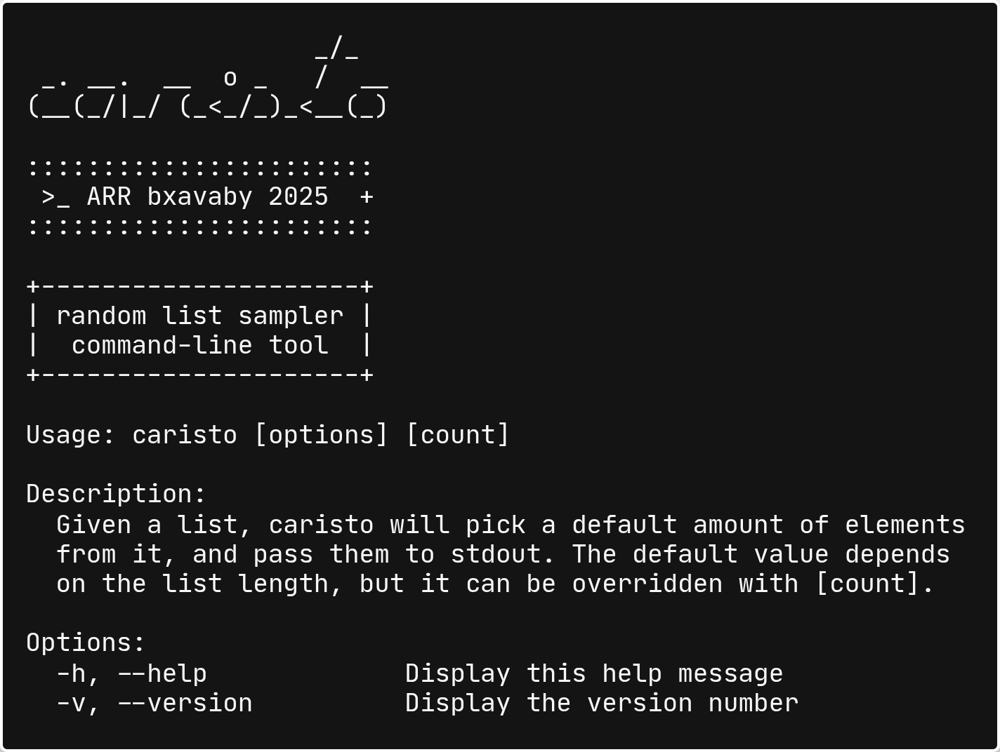

<div align=center>

### `babynames.txt | caristo 1`

_The only tool you will ever rarely need!_

───────────────────


[](https://github.com/bxavaby/caristo/commits/main)

<br>



<br><br>

<div align="left">

## Install

Download the latest binary for your platform from [**Releases**](../../releases/latest) and add it to your PATH:

<br>

**Linux (x86_64):**
```
wget https://github.com/bxavaby/caristo/releases/latest/download/caristo-linux-x86_64
chmod +x caristo-linux-x86_64
sudo mv caristo-linux-x86_64 /usr/local/bin/caristo
```

**Linux (ARM64):**
```
wget https://github.com/bxavaby/caristo/releases/latest/download/caristo-linux-aarch64
chmod +x caristo-linux-aarch64
sudo mv caristo-linux-aarch64 /usr/local/bin/caristo
```

**macOS (Intel):**
```
curl -LO https://github.com/bxavaby/caristo/releases/latest/download/caristo-macos-x86_64
chmod +x caristo-macos-x86_64
sudo mv caristo-macos-x86_64 /usr/local/bin/caristo
```

**macOS (Apple Silicon):**
```
curl -LO https://github.com/bxavaby/caristo/releases/latest/download/caristo-macos-aarch64
chmod +x caristo-macos-aarch64
sudo mv caristo-macos-aarch64 /usr/local/bin/caristo
```

<br>

<details>
<summary><b>Build from source (alternative)</b></summary>

<br>

```
git clone https://github.com/bxavaby/caristo.git
cd caristo
zig build -Doptimize=ReleaseSmall
sudo mv zig-out/bin/caristo /usr/local/bin/
```

</details>

<br>

> ※ **Note:** If you are on Windows, download `caristo-windows-x86_64.exe` from [Releases](../../releases/latest) and add to your PATH.

<br>

## Roadmap

- [ ] Add `-u` / `--unique` / `unique` to prevent repetition in selected elements

</div>

───────────────────

**[Report Bug](../../issues)** | **[Suggest Feature](../../issues)**

**MIT License © 2025 bxavaby**
